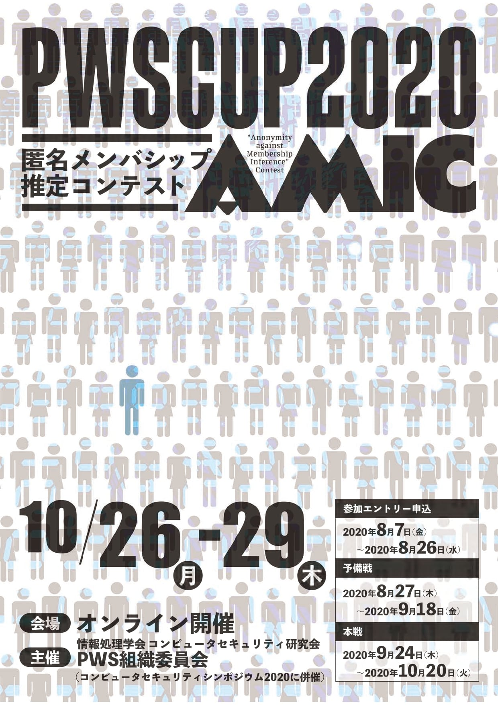
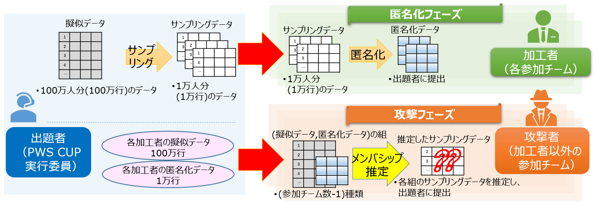

# PWS Cup 2020 

 
  <a href="./cup20_e.html">[English]</a>
 

 

## What' new

- 2020/02/18(火) 本ページを作成
- 2020/07/29(水) ルール案の概要を作成
- 2020/08/07(金) エントリー受付を開始しました
    - [参加規程](./entry.html)をご確認の上、エントリーフォームより登録をお願いします
- 2020/08/19(水) 08/26(水) 17:00-19:00に、ルール説明会(@WebEX)を行います
    - ページ下部の「PWS Cup 2020 スケジュール」をご確認ください
- 2020/08/26(水) ルール説明会(@WebEX)を行いました
    - 説明会で利用したルール詳細資料は[こちら](./Images/PWSCUP2020_rule_20200826.pdf)です
- 2020/08/27(木): 予備戦匿名化フェーズをスタートしました。(2020/09/07(月) 23:59:59 JST までです).
    - チーム代表者の方にメールでご案内しました (件名: "[PWSCUP2020] Your team accout").
- 2020/09/04(金): [ルール資料第2版](./Images/PWSCUP2020_rule_20200904.pdf)を公開しました
    - 変更点は[変更履歴.xlsx](./Images/PWSCUP2020_ルール変更履歴.xlsx)に記載しています。ご確認ください。
- 2020/09/09(水): 予備戦攻撃フェーズをスタートしました。(2020/09/18(金) 23:59:59 JST までです).
    - チーム代表者の方にメールでご案内しました
- 2020/09/23(水): 予備戦振り返りMeetUPを実施しました
    - 資料は09/24(木)に、各チームに公開しました
- 2020/09/24(木): 本戦匿名化フェーズをスタートしました。(2020/10/05(月) 23:59:59 JST までです)
    - チーム代表者の方にメールでご案内しました
- 2020/09/25(金): 予備戦の正解データを公開しました
    - チーム代表者の方にメールでご案内しました
- 2020/10/07(水): 本戦攻撃フェーズをスタートしました。(2020/10/20(火) 23:59:59 JST までです)
    - チーム代表者の方にメールでご案内しました
- 2020/10/19(月): [PWS Cup 2020 Sessionのご案内](./session.html)を公開しました
- 2020/10/20(火): 本戦攻撃フェーズを終了しました。結果は、[PWS Cup2020Session](./session.html)で発表します！

## PWS Cup 2020 匿名メンバシップ推定コンテスト AMIC ルール概要
匿名メンバシップ推定コンテスト "AMIC" ("Anonymity against Membership Inference" Contest)を開催します。

[ルール詳細資料(Ver.2)はこちら](./Images/PWSCUP2020_rule_20200904.pdf)です。

[サンプルデータ・サンプルスクリプトはこちら](./Images/PubInfo_20200826.zip)です。

- コンテストの流れ
    - 出題者(運営)は、10万人分の「擬似データ」を生成する。そして擬似データから10%（1万人分）をランダムに抽出した「サンプリングデータ」を参加チーム毎に生成し、参加チームに配布する。
    - 加工者(各参加チーム)は、「サンプリングデータ」を加工（匿名化）して作成した「匿名化データ」を提出する。「匿名化データ」が、指定された有用性基準を満たしていない場合は失格。
    - 攻撃者(他の参加チーム)は、自分以外の全加工者の(擬似データ、匿名化データ)の組を受け取り、自分以外の全加工者の「サンプリングデータ」を推定する。

- 採点
    - 匿名化部門：各攻撃者が推定に成功した数の合計を加工者の減点とし、得点の高い加工者が勝利
    - 攻撃部門：匿名化部門優勝者のサンプリングデータの推定により多く成功した攻撃者が勝利

- 最終順位の確定
    - 予備戦と本戦の2つのフェーズを設けて、各フェーズでデータ配布・加工・攻撃・評価を実施する。
    - 各フェーズでの採点結果を利用して最終順位を定める

## 主催
- 情報処理学会 コンピュータセキュリティ研究会 PWS2020実行委員会 Cupワーキンググループ

## PWS Cup 2020 スケジュール
スケジュールは予告なく変更することがあります。あらかじめご了承ください

- 2020/08/07(金) - 2020/08/26(水) エントリー受付
- 2020/08/26(水) ルール公開
- 2020/08/27(木) - 2020/09/18(金) 予備戦
- 2020/09/24(木) - 2020/10/20(火) 本戦
- 2020/10/27(火) CSS2020にて、最終結果発表
- 2020/10/27(火) CSS2020にて、各チームの加工・攻撃手法のポスターセッション

## 参加方法
- [参加規定](./entry.html)のページをご確認ください。

## 参加チーム

<table border="1">
<tr><td>チーム名 </td><td>意気込み</td><td>チーム代表者</td><td>所属</td></tr>
<tr><td>Brown DP</td><td></td><td>-</td><td>-</td></tr>
<tr><td>鋼鉄の錬金術師</td><td>今年も錬金します。</td><td>中川拓麻</td><td>日鉄ソリューションズ株式会社</td></tr>
<tr><td>Yichi</td><td></td><td>Ruska</td><td>-</td></tr>
<tr><td>小熊軟糖🧸</td><td></td><td>-</td><td>-</td></tr>
<tr><td>たけのこ半島</td><td>頑張ります</td><td>-</td><td>-</td></tr>
<tr><td>JOSE2</td><td>がんばります</td><td>-</td><td>三菱電機株式会社</td></tr>
<tr><td>サイコロ</td><td></td><td>-</td><td>-</td></tr>
<tr><td>SynIPA</td><td></td><td>Alexandre Roy-Gaumond</td><td>UQAM</td></tr>
<tr><td>ホンワカインコ</td><td>ほんわか楽しみたいと思います</td><td>-</td><td>-</td></tr>
<tr><td>🍎🍎🍎</td><td>がんばります</td><td>北島祥伍</td><td>株式会社ミクシィ</td></tr>
<tr><td>ステテコ大木</td><td>🥺</td><td>菅沼弥生</td><td>静岡大学大木研究室</td></tr>
<tr><td>ステテコ西垣</td><td>明治大には負けません！</td><td>北川沢水</td><td>静岡大学西垣研究室</td></tr>
<tr><td>ステテコ菊池</td><td>静岡大には負けません</td><td>伊藤聡志</td><td>明治大学大学院</td></tr>
<tr><td>匿工野郎Aチーム</td><td></td><td>-</td><td>-</td></tr>
<tr><td>天然水</td><td>精一杯がんばります！</td><td>石原詢大</td><td>筑波大学</td></tr>
<tr><td>docomo freshers</td><td>楽しみます</td><td>片山源太郎</td><td>株式会社NTTドコモ</td></tr>
<tr><td>wakanalie</td><td></td><td>-</td><td>-</td></tr>
<tr><td>初ぼっち</td><td>ぼっちなので何もできないかもしれません。</td><td>-</td><td>-</td></tr>
<tr><td>テレぼっち</td><td>テレワークなので、例年よりぼっち度をアゲてがんばります！</td><td>井口誠</td><td>Kii株式会社</td></tr>
</table>

## 最終結果
### 総合
- 第1位 333点 03 鋼鉄の錬金術師（匿名化部門1位、攻撃部門2位）
- 第2位 143点 08 サイコロ　　　（匿名化部門3位、攻撃部門4位）
- 第3位 083点 06 たけのこ半島　（匿名化部門5位、攻撃部門7位）

### 匿名化部門
- 第1位 877点 03 鋼鉄の錬金術師
- 第2位 840点 18 天然水第
- 第3位 813点 08 サイコロ

### 攻撃部門
- 第1位 122点 14 ステテコ大木
- 第2位 121点 03 鋼鉄の錬金術師
- 第3位 108点 21 wakanalie

結果詳細は11/02週に掲載します！

## PWS Cup 2020 セッション
- [PWS Cup 2020 セッションのご案内](./session.html) ページをご確認ください

## プライバシーポリシー
- [PWS Cup 2020 プライバシーポリシー](./privacy_policy.html)をご確認ください。

## 公式Twitter

- [PWSCUP公式Twitter](https://twitter.com/pwscup_admin)で最新情報をお知らせしています。

## お問い合わせ先

- PWS2020実行委員会 Cupワーキングループ
    - pwscup2020-info(at)iwsec.org
