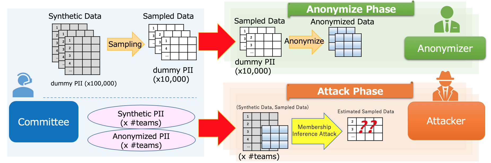

# PWS Cup 2020

## What' new

- 2020/02/18(Tue) This page was created
- 2020/07/29(Wed) Contest overview was added

## PWS Cup 2020 "AMIC" rule (overview)
The Anonymous Membership Inference Contest "AMIC" (Anonymous Membership Inference Contest) will be held. Details of the rules will be published at a later date.

- Contest Flow
    - The Committee generates "synthetic-data" for each participating team. The "sampled data" is extracted from the "synthetic-data" and distributed to the participating teams.
    - The anonymizer (each team) processes the "sampled-data" and submits the "anonymized-data". If the "anonymized-data" does not meet the specified criteria for utility, it will be disqualified.
    - The attacker (each team) receives a pair of (synthetic-data, anonymized-data) of all anonymizers other than themselves. From the "anonymized-data", the attacker estimated the "sampled-data".

- Evaluation
    - Anonymization phase: the total number of successful estimates made by each attacker is deducted from the anonymizer's points, and the anonymizer with the highest score wins
    - Attack phase: the attacker with more success in estimating the sampled data of the winner of the anonymization phase wins.

- Determination of Final Ranking
    - There will be two rounds in this contest, the preliminary and final round, and each round has distribute, anonymize, and attack phase.
    - The results of the scoring in each round will be used to determine the final rankings.

## PWS Cup 2020 schedle (作成中)

- 2020/07/29(Wed) - 2020/08/26(Wed) Entries accepted
- 2020/07/?? (?) Rules published
- 2020/08/03(Mon) - 2020/08/31(Mon) Preliminary round Anonymization Phase
- (The schedule after is under consideration.)
- 2020/10/26(Tue) Final results announced at CSS2020 
- 2020/10/26(Tue) Poster session 

## How to register
- Check the [Entry](./entry_e.html) page

## Twitter

[PWS Cup Official Twitter](https://twitter.com/pwscup_admin)

## Contact

- PWS2020 Committee
  - (作成中)
