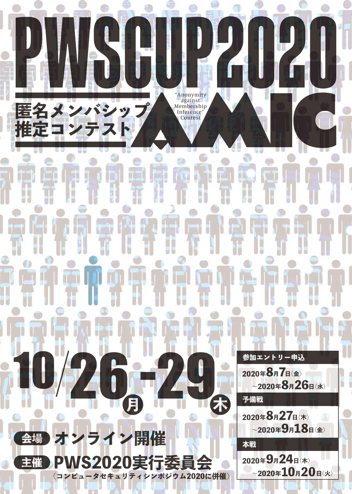
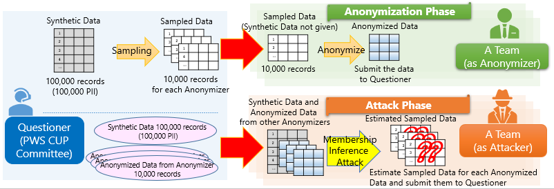

# PWS Cup 2020

 
  <a href="./cup20.html">[Japanese]</a>
 

 

## What' new

- 2020/02/18 (Tue): This page was created
- 2020/07/29 (Wed): Contest overview was added
- 2020/08/06 (Thu): Contest registration started 

## PWS Cup 2020 "AMIC" rule (overview) (WIP)
The Anonymous Membership Inference Contest "AMIC" ("Anonymity against Membership Inference" Contest) will be held. Details of the rules will be published at a later date.

- Contest Flow
    - The **Committee** generates **Synthetic Data** for each participating team. The Committee then generates **Sampled Data** by extracting records from the Synthetic Data with the sampling ratio of 10%. The Synthetic Data is distributed to the participating teams.
    - Each team (as an **Anonymizer**) processes their Sampled Data and generates **Anonymized Data**. The Anonymizer then submits their Anonymized Data to the Committee. The submitted Anonymized data must fulfill the data utility requirements designated by the Committee, or the team will be disqualified.
    - Each team (as an **Attacker**) receives pairs of (Synthetic Data, Anonymized Data) of all Anonymizers other than themselves. From the Anonymized Data, the Attacker estimates the Sampled Data.

- Evaluation
    - Anonymizer Phase: the total number of records successfully estimated by Attackers is deducted from the Anonymizer's point. The Anonymizer with the highest points will be a winner of the anonymization phase.
    - Attacker Phase: the Attacker who successfully estimated the most records in Sampled Data submitted by the Anonymize phase winner will be a winner of the attack phase.

- Determination of Final Ranking
    - There will be two rounds in this contest: the preliminary and final round. Each round has distribution, anonymization, and attack phases.
    - The results of the scoring in both rounds will be used to determine the final rankings.

## PWS Cup 2020 schedle (WIP)

- 2020/08/06(Thu) - 2020/08/26(Wed) Entries accepted
- 2020/08/?? (?) Rules published
- 2020/08/27 (Thu) - 2020/09/??(?) Preliminary round Anonymization Phase
- (The schedule after is under consideration.)
- 2020/10/26(Tue) Final results announced at CSS2020 
- 2020/10/26(Tue) Poster session 

## How to register
- Check the [Entry](./entry_e.html) page

## Twitter

[PWS Cup Official Twitter](https://twitter.com/pwscup_admin)

## Contact

- PWS2020 Committee
    - pwscup2020-info(at)iwsec.org

