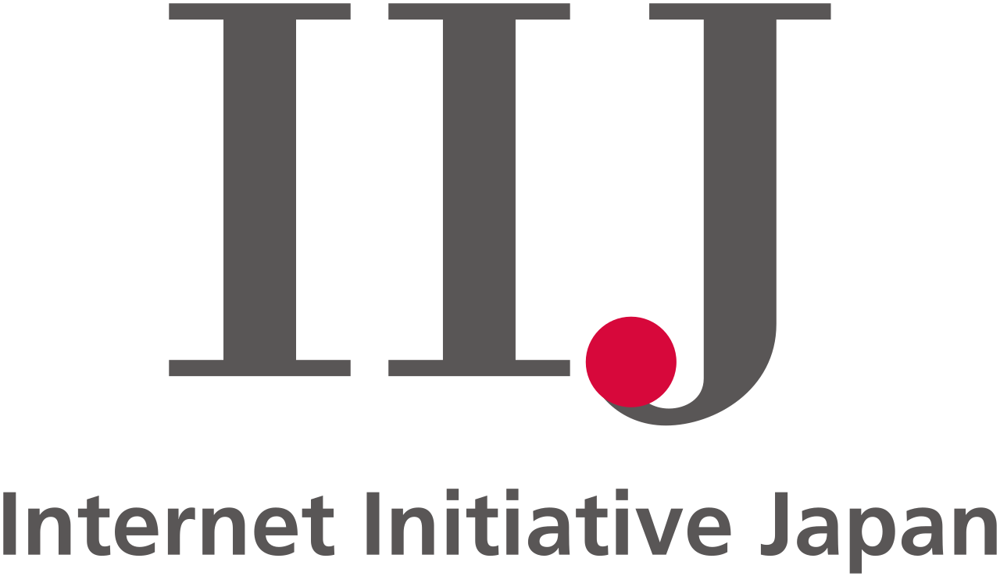
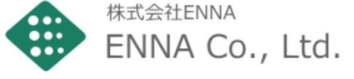
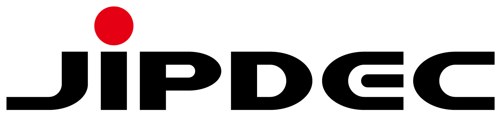
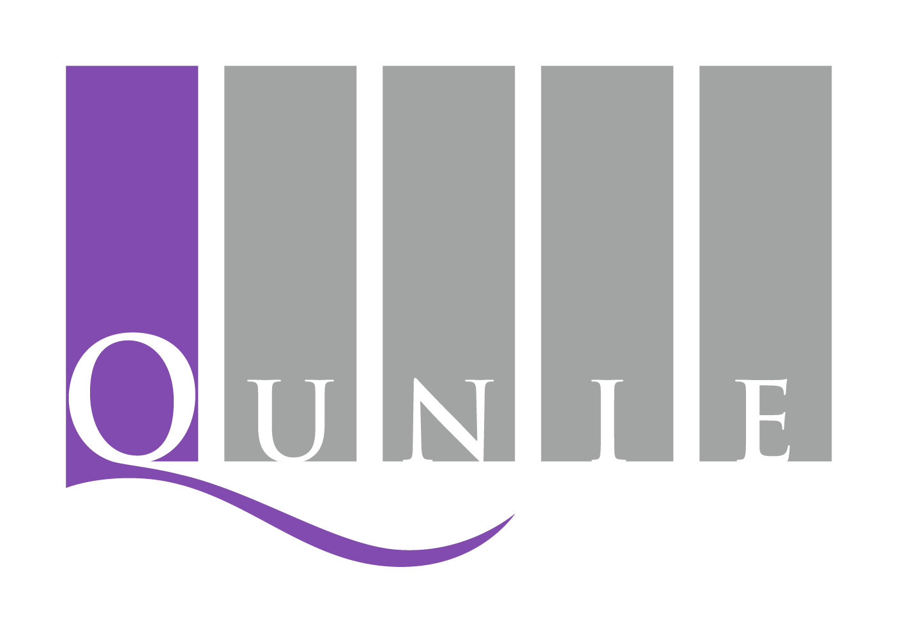

# 第6回プライバシーワークショップ (PWS2020)

 
  <a href="./index_e.html">[English]</a>
 

## What's new
- 2020/02/18(火) 本ページの作成を開始
- 2020/05/27(水) ページを更新(実行委員長・副実行委員長名を記載)
- 2020/07/02(水)  [PWS読破会](./study20.html)のご案内ページを作成
- 2020/07/04(土)  [PWS講演企画](./lecture20.html)のご案内ページを作成
- 2020/08/07(金)  PWS Cup 2020のエントリー受付を開始　[こちら](./cup20.html)をご確認ください

## PWS(Privacy Workshop)について
### 概要

国内外においてビッグデータ活用ニーズが急速に高まる中で、データの効果的な活用とプライバシー保護を両立させる技術や規準の発展と確立が強く求められています。そのためには、プライバシー保護技術の研究開発を進める学術機関とデータ活用の現場で活躍する技術者・専門家との間での議論や交流を活発にし、日本におけるプライバシー保護技術の研究開発を活性化していくことが重要と考えられます。

上記を目的として、情報処理学会コンピュータセキュリティ研究会 (CSEC 研究会) はPWS 組織委員会を立ち上げ、同学会セキュリティ心理学とトラスト研究会 (SPT 研究会)との共催で「プライバシーワークショップ (PWS)」を開催いたします。PWS は、コンピュータセキュリティシンポジウム (CSS) の併催として年に一度開催予定であり、主にデータ活用を円滑にするためのプライバシー保護技術に焦点を当てた企画およびセッションから構成されます。

### 開催日時
- 2020/10/26(月) - 2020/10/29(木)

<h3>PWS2020実行委員会 </h3>
<dl>
 <dt>委員長</dt>
  <dd>寺田雅之 (NTTドコモ)</dd>
 <dt>副委員長</dt>
  <dd>千田浩司 (NTT)</dd>
 <dt>委員</dt>
  <dd>荒井ひろみ (理化学研究所) 、井口誠 (Kii) 、伊藤伸介 (中央大学) 、小栗秀暢 (富士通研究所) 、菊池浩明 (明治大学) 、黒政敦史 (富士通クラウドテクノロジーズ) 、須川賢洋 (新潟大学) 、清雄一 (電気通信大学) 、高橋翼 (LINE) 、竹之内隆夫 (デジタルガレージ) 、玉井睦 (セコム) 、中川裕志 (理化学研究所) 、中村優一 (早稲田大学) 、西山賢志郎 (ビズリーチ) 、野島良 (NICT) 、波多野卓磨 (日鉄ソリューションズ) 、濱田浩気 (NTT) 、古川諒 (NEC) 、美馬正司 (日立コンサルティング) 、南和宏 (統計数理研究所) 、村上隆夫 (産業技術総合研究所) 、山岡裕司 (富士通研究所) 、山田明 (KDDI総合研究所) 、渡辺知恵美 (筑波技術大学) </dd>
</dl>

### 参加登録

PWS2020への参加登録は、[コンピュータセキュリティシンポジウム2020 (CSS2020)](https://www.iwsec.org/css/2020/index.html)への参加登録と共通となっております (ご登録頂くと、CSS2020 および併催のMWS2020、OWS2020、UWS2020などのセッションにも参加が可能です)。

参加登録手続きの詳細につきましては、CSS2020の「参加登録」ページおよび 「参加費の説明」ページ をご参照ください。

### 論文投稿 (発表申し込み)

PWS2020への論文投稿受付は、[コンピュータセキュリティシンポジウム2020 (CSS2020) への論文投稿受付](https://www.iwsec.org/css/2020/writing.html)と共通となっております。

ご投稿頂いた論文の発表セッションの割り当ては、ご投稿頂く論文の概要やキーワードを参考にCSS2020プログラム委員会により定められますが、特にPWS2020でのご発表を希望される場合、発表申し込みの手続きにおいて「PWS」をお選びください。 なお、発表多数の場合など、会場準備の都合上 PWS でのご発表をご希望されてもCSSのセッションでのご発表となる場合があります。恐れいりますが、あらかじめご承知おきのほどお願いいたします。

### 論文賞

以下の2つの賞を設けています。

- PWS優秀論文賞
    - PWSセッションにおける発表論文のうち、プライバシー保護技術の発展やプライバシーリスクの正しい啓発にとくに貢献すると認められる論文1編を、PWSトラックのプログラム委員による審議を経て決定し、当該論文の著者全員を表彰します。
    - CSS最優秀論文賞/優秀論文賞/学生論文賞など、CSS2020において設けられる他の賞との重複受賞を妨げるものではありません。

- PWS学生論文賞
    - PWSセッションにおける講演者が学生（社会人学生を除く）の発表論文のうち、プライバシー保護技術の発展やプライバシーリスクの正しい啓発にとくに貢献すると認められる論文1編を、PWSトラックのプログラム委員による審議を経て決定し、当該論文の著者全員を表彰します。
    - CSS最優秀論文賞/優秀論文賞/学生論文賞など、CSS2020において設けられる他の賞との重複受賞を妨げるものではありません。
    
## 協賛組織

## 後援組織

[個人情報保護委員会](https://www.ppc.go.jp/)

## 過去のPWS
- [PWS2019](https://www.iwsec.org/pws/2019/)
- [PWS2018](https://www.iwsec.org/pws/2018/)
- [PWS2017](https://www.iwsec.org/pws/2017/)
- [PWS2016](https://www.iwsec.org/pws/2016/)
- [PWS2015](https://www.iwsec.org/pws/2015/)

## プライバシーポリシー

PWS2020のプライバシーポリシーは、 [CSS2020のプライバシーポリシー](https://www.iwsec.org/css/2020/privacy.html)に準じます。

