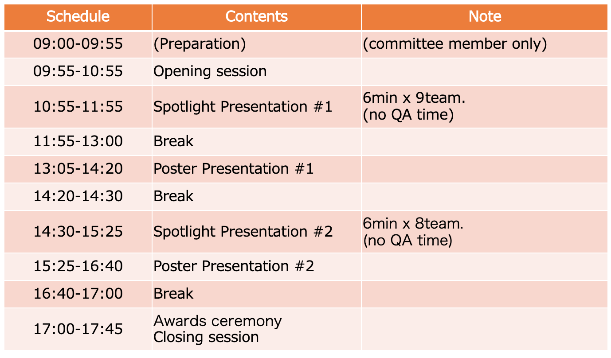

PWS Cup 2020 Session 2020/10/27(Tue) 09:55 ~ 17:45
==

Information for PWS Cup 2020 Session.

## [ALL] Timetable

 

## [Team] Group 

### Group 1 (Spotlight: 10:55-11:55, Poster: 13:05-14:20)
- 03鋼鉄の錬金術師
- 06たけのこ半島
- 07JOSE2
- 08サイコロ
- 11SynIPA
- 12ホンワカインコ
- 13りんご
- 14ステテコ大木
- 15ステテコ西垣

### Group 2 (Spotlight: 14:30-15:25、Poster: 15:25-16:40)
- 16ステテコ菊池
- 17-
- 18天然水
- 19docomo freshers
- 21wakanalie
- 22初ぼっち
- 23テレぼっち
- 27M.AI

## Notes
###  Team Presentation
- Please introduce your anonymize/attack method at Spotlight session(6min) and Poster session (75min).
#### Spotlight session (6min)
   - Please introduce the summary of anonymize/attack method.
   - We will invite you to the Zoom session for PWS Cup 2020.
   - We will inform you of the time schedule, url for the Zoom session, etc... later(around 10/20(Tue)).
#### Poster session (75min)
  - Please introduce the details of the  anonymize/attack method, and discuss with the participants.
  - We will set the Zoom-breakout room for each team's poster presentation.

### Zoom Client
- Please update the Zoom client
- Please use the latest version Zoom. (>v5.3.0)
  - If you use the old version, you can not choose the breakout rooms as you like.

### The deadline of uploading the material
- Please upload your poster by "2020/10/26(Mon) 23:59:59 JST" to the GoogleDrive Folder.
- Poster filename: [teamid]_[teamname].pdf (ex: 01_テストチーム.pdf)
- There is no restriction in the format/size/etc... to the poster file.

## Contact
- PWS2020 Committee, PWS Cup Working Group
  - pwscup2020-info(at)iwsec.org
