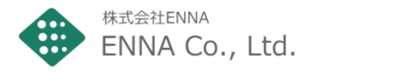
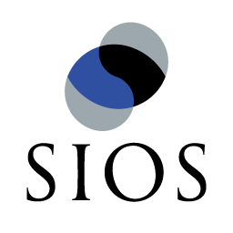

# The 7th Privacy Workshop (PWS2021)

 
  <a href="./index.html">[Japanese]</a>
 

## What's new
- July 26th, 2021: Updated information.
- July 22nd, 2021: PWS Cup 2021 entry started. Please check [PWS Cup 2021 page](./cup21_e.html).
- May 28th, 2021: Created this page.

## About PWS (Privacy Workshop)
### Overview

As the need for big data utilization grows rapidly in Japan and overseas, there is a strong need for developing and establishing technologies and standards that balance the effective use of data while preserving privacy. To achieve this goal, it is essential to activate research and development of privacy protection technologies in Japan; this can be accomplished through active discussions and exchanges among academic institutions that promote research and development of privacy protection technologies and practitioners in industry who are active in the field of data utilization.

For the above purpose, the Computer Security Special Interest Group (CSEC) of the Information Processing Society of Japan has established the PWS Organizing Committee and co-hosted the “Privacy Workshop (PWS)” with the Security Psychology and Trust Special Interest Group (SPT) of the Information Processing Society of Japan. The PWS is scheduled to be held annually in conjunction with the Computer Security Symposium (CSS) and consists of events and sessions focusing mainly on privacy protection technologies for facilitating data utilization.

### Schedule

- Tue., October 26th, 2021 - Fri., October 29th, 2021

### PWS Committee

<dl>
 <dt>Chair</dt>
 <dd>Masayuki Terada (NTT DOCOMO)</dd>
 <dt>Co-Chair</dt>
 <dd>Koji Chida (NTT)</dd>
 <dt>Members</dt>
 <dd>Hiromi Arai (RIKEN), Makoto Iguchi (Kii), Shinsuke Ito (Chuo University), Hidenobu Oguri (Fujitsu), Hiroaki Kikuchi (Meiji University), Atsushi Kuromasa (Fujitsu Cloud Technologies), Masahiro Sugawa (Niigata University), Yuichi Sei (The Univesity of Electro-Communications), Tsubasa Takahashi (LINE), Takao Takenouchi (Digital Garage), Mutsumi Tamai (SECOM), Hiroshi Nakagawa (RIKEN), Yuichi Nakamura (Waseda University), Kenshiro Nishiyama (Bizreach), Ryo Nomura (NICT), Takuma Hatano (NS Solutions), Koki Hamada (NTT), Masahiro Fujita (Mitsubishi Electric), Ryo Furukawa (NEC), Ruiqiang Ma (Meiji University), Wakana Maeda (Fujitsu), Shoji Mima (Hitachi Consulting), Kazuhiro Minami (The Institute of Statistical Mathematics), Takao Murakami (AIST), Yuji Yamaoka (Fujitsu), Akira Yamada (KDDI Research), Chiemi Watanabe (Tsukuba University of Technology)
 </dd>
</dl>

### Registration for Participation

To regsiter for PWS2021, please visit the registration site of [Computer Security Symposium 2021 (CSS2021)](https://www.iwsec.org/css/2021/index.html)(in Japanese). By registering for CSS2021, you will be able to participate in CSS2021 and the joint sessions.

For more information about the registration process, please check the CSS2021 registration site and its registration fee page.

### Paper Submission

To submit your paper to PWS2021, please submit the paper to Computer Security Symposium 2021 (CSS2021).

The CSS2021 Program Committee will decide a session your paper is to be presented on the basis of the paper's summary and keywords.  
If you wish to present your paper in PWS2021 session, please select "PWSトラック" when you submit your paper.  
Please note that we might not be able to accommodate your request to present your paper in PWS2021 session due to the number of paper submission.  
In such a case, we might ask you to present your paper in other CSS sessions.

Please note that conventional awards in PWS (the PWS Paper Award and the PWS Student Paper Award) will be integrated with relevant awards in CSS2021.

## Sponsors

## Supporters

TBD

## Past PWS
- [PWS2020](https://www.iwsec.org/pws/2020/index_e.html)
- [PWS2019](https://www.iwsec.org/pws/2019/index_e.html)
- [PWS2018](https://www.iwsec.org/pws/2018/) (in Japanese)
- [PWS2017](https://www.iwsec.org/pws/2017/) (in Japanese)
- [PWS2016](https://www.iwsec.org/pws/2016/) (in Japanese)
- [PWS2015](https://www.iwsec.org/pws/2015/) (in Japanese)

## Privacy Policy

The PWS2021 privacy policy is governed by the [CSS2021 privacy policy](https://www.iwsec.org/css/2021/privacy.html).
