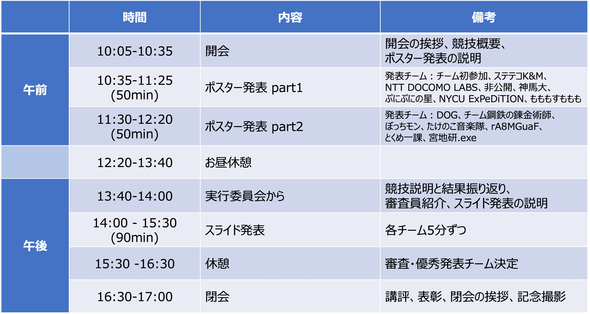

# PWS Cup 2022 セッション 2022/10/26(Wed) 10:05 ~ 17:00

 
  <a href="./session_e.html">[English]</a>
 

PWS Cup 2022 セッションのご案内です。

## [全体] タイムテーブル

 

## 発表要項
### 発表内容: 本戦で用いた攻撃と匿名化の手法の解説
- 予備戦についても解説してもよい
- 表彰: 最も優れた発表と認められたチームには"**優秀発表賞**"を授与

### ポスター発表
- 実施形態: 参加チームを2グループに分けて実施、各パート50分を予定
    - Zoomにてチームごとのブレイクアウトルームを用意しますので、それぞれの部屋ごとに、訪れた方にプレゼンをおこなってください。
    - 用意したポスターファイルを使って発表してください（PDFまたは元になったPPTなど）。必要に応じて追加の資料を使用してもかまいません。
- グループ分け
    - Part 1（10:35-11:25） 発表チーム:  
    チーム初参加、ステテコK&M、NTT DOCOMO LABS、非公開、神馬大、ぷにぷにの星、NYCU ExPeDiTION
    - Part 2（11:30-12:20） 発表チーム:  
    DOG、チーム鋼鉄の錬金術師、ぼっちモン、たけのこ音楽隊、もももすももも、rA8MGuaF、とくめ一課、宮地研.exe

### スライド発表
- 実施形態: 各チーム5分ずつ、匿名加工フェーズ、攻撃フェーズをどのように戦ったのかを発表
    - Zoomの共有機能を使い、順番に発表していただきます。5分経った時点で途中でも発表終了となります。
    - 発表資料は、各チームで自由に用意してください（事前提出不要）
- 質疑なし
- 発表順
    1. チーム初参加
    2. ステテコK&M
    3. NTT DOCOMO LABS
    4. 非公開
    5. 神馬大
    6. ぷにぷにの星
    7. NYCU ExPeDiTION
    8. DOG
    9. 鋼鉄の錬金術師
    10. ぼっちモン
    11. たけのこ音楽隊
    12. もももすももも
    13. rA8MGuaF
    14. とくめ一課
    15. 宮地研.exe

### ポスターの提出
- ハイブリッド開催に伴う準備のため、ポスターは事前にご提出いただきます。
- **締切: 10/25（火）昼 11:59:59(JST)**
- 提出方法: メールでご案内したポスター要項の内容で作成いただき、チーム名を記載の上 pwscup2022-info(at)iwsec.org （(at) を@に直してください）宛に、メールで提出してください。

## お問い合わせ先
発表・聴講に関するご質問は、以下にお願いします。

PWS組織委員会 PWS Cup 2022 ワーキンググループ
   - pwscup2022-info(at)iwsec.org （(at) を@に直してください）
