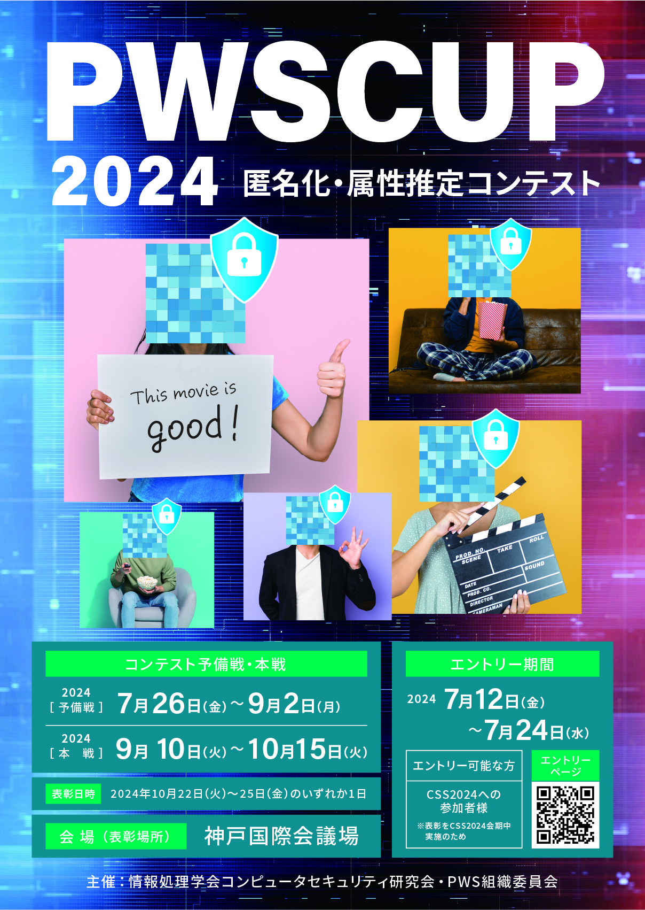

# PWS Cup 2024

 

## What's New
- 2024/07/12(金) [エントリー方法](./entry.html)を公開
- 2024/06/22(土) [PWSCup2024＆iPWSCup2024説明会の参加登録URL](https://docs.google.com/forms/d/e/1FAIpQLScY3xI5OZ3x-ry0f8vFMXfPg_MtxvCpgMyljJrbd1lpjFK6Cw/viewform)を公開
- 2024/06/14(金) 本ページを作成

## PWS Cup 2024 概要
### コンテストストーリー
企業Aは顧客データを利用して映画の推薦システムを作りたいと思い、推薦システム開発のコンペのために顧客データを匿名化してコンペ参加者に提供することとした。しかし匿名化したつもりでも、外部のデータと突き合わせるなどして個人特定されたりプライバシーが侵害されたりした事例がある。さらに最近では、安全とおもわれる匿名化データや統計データでも複数組み合わせると元のデータが復元されてしまう「データベース再構築攻撃」も問題となっている。企業Aは、個人特定攻撃やデータベース再構築攻撃を防ぎつつ、有用性の高い匿名化データを作成できるだろうか？

### コンテスト概要
コンテスト参加者は、加工者と攻撃者の双方の立場となって、データの加工と、加工されたデータへの攻撃技術を競います。データの加工では、参加者は顧客データを公開したい企業を想定した加工者となり、与えられたデータを加工してデータに含まれる人のプライバシーを保護することを目指します。加工されたデータへの攻撃では、参加者はデータの中身を暴こうとする人を想定した攻撃者となり、他の参加者が加工したデータに含まれる人の秘密の情報をより多く暴くことを目指します。

### コンテストの流れ
コンテストは、以下の2つのフェーズからなります。

1. 加工フェーズ:
   - 各チームは、映画の評価に関する架空のデータから、複数の匿名化データを作成する（各匿名化データは、多属性の元データから、分析用途に応じて必要な属性のみ抽出したデータを加工したものとする）。
   - 匿名化データは、有用性をなるべく損ねることなく、他人が元の情報を特定しづらいように加工すること。
2. 攻撃フェーズ:
   - 各チームは、出題者によっていくつか黒塗りされた元データの値を、匿名化データを用いて推定する（データベース再構築攻撃）。
   - また、氏名等が切り離された元データを、匿名化データを用いて氏名等とつなぎ合わせて個人特定を試みる。

これらを順に実施した後、出題者により各チームの加工と攻撃の結果が評価されます。加工の評価は加工データと元データからそれぞれ得られる分析結果の近さ（近いほどよい）と秘密データの他のチームからの正しい推測の困難さ（困難であるほどよい）の観点から、攻撃の評価は他のチームの加工データに対する推測の正確さ（正確であるほどよい）の観点から、それぞれ行います。コンテスト期間中に加工フェーズ、攻撃フェーズ、評価の一連の流れを2回実施します。1回目を予備戦、2回目を本戦と呼び、予備戦と本戦での評価結果を総合して本コンテストの勝者を決定します。

## 参加者向け資料

## 主催
情報処理学会 コンピュータセキュリティ研究会 PWS組織委員会  
（コンピュータセキュリティシンポジウム2024に併催）

## PWS Cup 2024 スケジュール
スケジュールは予告なく変更することがあります。あらかじめご了承ください。
本ページに記載の日時は特に断りのない限り日本標準時(JST)です。システムに記載の日時は協定世界時(UTC)ですので、ご注意ください。

<table border="0">
<tr><td> <strong>日付</strong> </td><td> <strong>イベント</strong> </td></tr>
<tr><td> 2024/07/12(金) 16:00~17:00 </td> <td> PWS Cup 2024＆<a href="https://www.iwsec.org/pws/ipws2024/index.html"> iPWS Cup 2024</a>説明会 （参加登録は<a href="https://docs.google.com/forms/d/e/1FAIpQLScY3xI5OZ3x-ry0f8vFMXfPg_MtxvCpgMyljJrbd1lpjFK6Cw/viewform">こちら</a>)</td></tr>
<tr><td> 2024/07/12(金) ~ 2024/07/24(水) </td> <td> エントリー受付期間 </td></tr>
<tr><td> 2024/07/26(金) ~ 2024/09/02(月) </td> <td> 予備戦 </td></tr>
<tr><td> 2024/09/10(火) ~ 2024/10/15(火) </td> <td> 本戦 </td></tr>
<tr><td> 2024/10/22(火)~25(金)のいずれか1日 </td> <td> 発表・表彰式 </td></tr>
</table>

## 参加方法
- [エントリー方法のページ](./entry.html)をご参照ください。

## 参加チーム
TBD

## プライバシーポリシー
- [プライバシーポリシーのページ](./privacy_policy.html)をご参照ください。

## 公式X(旧Twitter)
[PWSCUP公式X](https://twitter.com/pwscup_admin)で最新情報をお知らせしています。

## お問い合わせ先
PWS組織委員会 PWS Cup 2024 ワーキンググループ  
- pwscup2024-info(at)csec.ipsj.or.jp（"(at)"をアットマーク"@"に置換ください）
