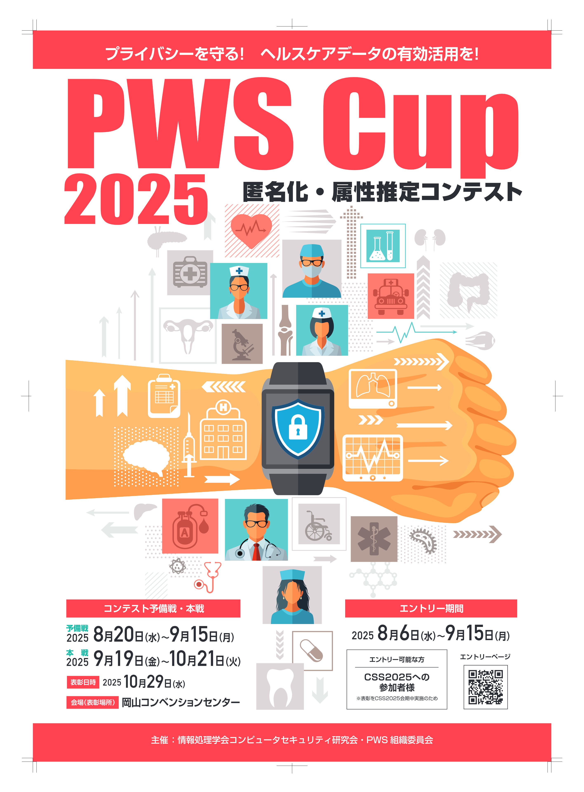
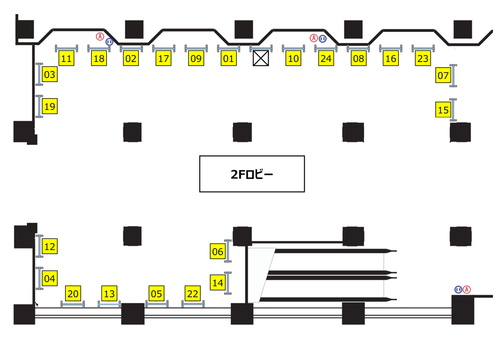

# PWS Cup 2025

  

## PWS Cup 2025 は終了しました。ご参加いただいたみなさま、ありがとうございました。

## What's New
- 2025/11/02(日) PWS Cup 2025 発表会資料を公開しました
- 2025/11/02(日) 本戦＆総合の結果と本戦結果詳細を公開しました
- 2025/11/02(日) 最終結果を掲載しました
- 2025/10/23(木) [PWS Cup 2025 発表・表彰式](#TheDay)を追記しました　**★New**
- 2025/10/08(水) [本戦の攻撃用データ](#main-attack-data)を公開しました
- 2025/09/29(月) [PWS Cup 2025 本戦ガイドブックを1.2版に更新](./Images/PWSCUP2025本戦ガイドブックv1.2.pdf)しました
- 2025/09/23(火) [PWS Cup 2025 本戦ガイドブックを1.1版に更新](./Images/PWSCUP2025本戦ガイドブックv1.1.pdf)しました
- 2025/09/22(月) [PWS Cup 2025 本戦ガイドブック](./Images/PWSCUP2025本戦ガイドブックv1.pdf)を作成しました
- 2025/09/18(木) [PWS Cup 2025 初心者向けガイド](https://github.com/pwscup/pwscup2025-scripts/blob/master/GUIDE_FOR_BEGINNERS.md)を作成しました
- 2025/09/17(水) [予備戦の正解ファイル](#pre-answer)を公開しました
- 2025/09/15(月) [予備戦の結果](#pre-result)を公開しました
- 2025/09/04(木) [予備戦の攻撃用データ](#pre-attack-data)を公開しました
- 2025/08/14(木) [サンプルデータとサンプルコード](https://github.com/pwscup/pwscup2025-scripts)を公開しました（随時追加予定）
- 2025/08/14(木) [説明会資料を更新](./Images/20250813_PWSCUP2025説明資料v2.pdf)しました
- 2025/08/06(水) [説明会資料をアップ](./Images/20250806_PWSCUP2025説明資料.pdf)しました
- 2025/08/06(水) [参加申込ページ](https://forms.gle/DAB4XDepKvDb1irt8)をオープンしました!
- 2025/07/14(月) 本ページを作成しました
- 2025/07/18(金) 説明会参加のご案内をスケジュール欄に追加しました（→[スケジュール](#schedule)）

## PWS Cup 2025 概要
### コンテストストーリー
高齢化社会、予防医療、パーソナライズド医療の進展に伴い、ヘルスデータの利活用は社会課題解決の鍵として注目されています。しかし、その活用にはプライバシーの壁が立ちはだかります。特にプライバシーを侵害する攻撃は年々高度化・多様化しています。
そこでPWS Cup 2025では、プライバシーを守りつつ安全にヘルスデータを利活用できるよう、以下の３つのテーマで技術を競います！

- 例年通り、各参加チームは「加工者」と「攻撃者」になり、加工者では他チームに攻撃されないような加工データを作成し、攻撃者では他チームの加工データを攻撃します。

- 今年はリアルに近いダミーのヘルスデータを用いて、医療・健康に資する分析や予測モデルの精度を競います。所与の分析や予測に対して有用性の高い加工データを作成してください。

- 攻撃手法は、近年様々なアルゴリズムが提案されている「メンバーシップ推定攻撃」をテーマにします。これは加工データから、特定個人の存在を推定する攻撃です。存在の有無さえ分からなければプライバシーは守られますが、存在の有無が分かると機微な情報が推定されてしまう場合があります。

### コンテストの流れ
コンテストは、以下の2つのフェーズからなります。

1. 加工フェーズ:
   - 各チームは、架空のヘルスデータから、匿名化データおよび機械学習モデルを作成する。
   - 匿名化データおよび機械学習モデルは、有用性をなるべく損ねることなく、他人が元の情報を特定しづらいように（メンバーシップ推定攻撃が困難となるように）加工すること。
2. 攻撃フェーズ:
   - 各チームは、加工フェーズ後に出題者が開示する他チームの元データ、匿名化データ、および機械学習モデルを使って、メンバーシップ推定攻撃を試みる（元データのうちどのデータを使って匿名化データや機械学習モデルを作成したか推定する）。

これらを順に実施した後、出題者により各チームの加工と攻撃の結果が評価されます。

- 加工の評価は、加工データと元データからそれぞれ得られる分析結果の近さ（近いほどよい）と、他のチームによる秘密データの正しい推測の困難さ（困難であるほどよい）の観点
- 攻撃の評価は、他のチームによる加工データに対する推測の正確さ（正確であるほどよい）の観点

から、それぞれ行います。コンテスト期間中に加工フェーズ、攻撃フェーズ、評価の一連の流れを2回実施します。1回目を予備戦、2回目を本戦と呼び、予備戦と本戦での評価結果を総合して本コンテストの勝者を決定します。

## 主催
情報処理学会 コンピュータセキュリティ研究会 PWS組織委員会 PWS Cup 2025 WG 
（コンピュータセキュリティシンポジウム2025に併催）

### PWS Cup 2025 WG メンバー
<dl>
 <dt>WG長</dt>
  <dd>千田 浩司 (群馬大学)</dd>
 <dt>WGメンバー(五十音順)</dt>
  <dd style="display: flex; flex-direction: column;">
井口 誠（Kii）, 伊藤 聡志（愛知学院大学）, 小野 元（金沢大学）, 菊池 浩明（明治大学）, 黒政 敦史（データ社会推進協議会）, 椎名 峻平（トヨタ自動車）, 中村 優一（ソフトバンク）, 西山 賢志郎（平田機工）, 野島 良（立命館大学）, 波多野 卓磨（日鉄ソリューションズ）, 濱田 浩気（NTT社会情報研究所）, 東 貴範（TOPPANデジタル）, 古川 諒（NEC）,  藤田 真浩（三菱電機）, 馬 瑞強（Inner Mongolia University of Technology）, 前田 若菜（LINEヤフー）, 三浦 尭之（NTT社会情報研究所）, 村上 隆夫（統計数理研究所）, 森 毅（日本総合研究所）, 山田 明（神戸大学）
  </dd>
</dl>
   
## PWS Cup 2025 スケジュール
スケジュールは予告なく変更することがあります。あらかじめご了承ください。
本ページに記載の日時は特に断りのない限り日本標準時(JST)です。

<table class="schedule">
  <colgroup>
    <col> <col> <col>
  </colgroup>

  <thead>
    <tr>
      <th>日付</th>
      <th>イベント</th>
      <th>備考</th>
    </tr>
  </thead>
  <tbody>
    <tr>
      <td>2025/08/06(水) 18:00 ~ 19:00</td>
      <td>PWS Cup 2025 説明会</td>
      <td>
        Zoom 開催。参加希望の方は
        <a href="https://forms.gle/akXvGdyZ8gRBkxKu7" target="_blank">
          PWS Cup 2025 説明会 参加登録ページ
        </a>
        からお申し込みください。 
        （申し込み後、ZoomログインURLがメール送信されます。 
        お申込みされた方には、説明会の録画のURLを後日お送りする予定です。）
      </td>
    </tr>
    <tr>
      <td>2025/08/06(水) ~ 2025/09/15(月)</td>
      <td>参加申込受付期間</td>
      <td><a href="https://forms.gle/DAB4XDepKvDb1irt8" target="_blank"> 参加申込ページ</a>　※2025/08/20(水) 以降の参加申込は本戦のみの参加になる場合があります</td>
    </tr>
    <tr>
      <td>2025/08/20(水) 09:00 ~ 2025/09/15(月) 09:00</td>
      <td>予備戦</td>
      <td></td>
    </tr>
    <tr>
      <td>2025/09/19(金) 09:00 ~ 2025/10/21(火) 09:00</td>
      <td>本戦</td>
      <td></td>
    </tr>
    <tr>
      <td>2025/10/29(水)</td>
      <td>発表・表彰式</td>
      <td>CSS2025 開催期間中</td>
    </tr>
  </tbody>
</table>

### PWS Cup 2025 発表・表彰式

  

日時：2025/10/29(水)

場所：岡山コンベンションセンター　C会場

タイムテーブル：

 9:10-9:30 開会式、競技説明、結果発表 
　
 9:30-10:20 Team01-08 プレゼン（各チーム5分） 
 
 10:20-10:40 休憩 
 
 10:40-11:25 Team01-08 ポスター発表 
 
 11:30-12:20 Team09-16 プレゼン（各チーム5分） 
 
 12:20-13:50 昼休み 
 
 13:50-14:35 Team09-16 ポスター発表 
 
 14:40-15:30 Team17-24 プレゼン（各チーム5分） 
 
 15:30-15:50 休憩 
 
 15:50-16:35 Team17-24 ポスター発表 
 
 16:35-17:00 休憩（授賞審査） 
 
 17:00-17:30 表彰式、閉会式、写真撮影 

## 参加チーム

<table class="schedule">
  <thead>
    <tr>
      <th scope="col">Team ID</th>
      <th scope="col">チーム名</th>
      <th scope="col">意気込み</th>
      <th scope="col">代表者</th>
      <th scope="col">代表者所属</th>
      <th scope="col">責任者</th>
      <th scope="col">責任者所属</th>
    </tr>
  </thead>
  <tbody>
    <tr>
      <td>01</td>
      <td>宮地研.exe</td>
      <td>頑張ります！</td>
      <td>柳下智史</td>
      <td>大阪大学 / 宮地研究室</td>
      <td>宮地充子</td>
      <td>大阪大学 / 宮地研究室</td>
    </tr>
    <tr>
      <td>02</td>
      <td>SHA-NES</td>
      <td></td>
      <td>（非公開）</td>
      <td>NECソリューションイノベータ</td>
      <td></td>
      <td></td>
    </tr>
    <tr>
      <td>03</td>
      <td>bot035</td>
      <td>試験的に参加しています。途中辞退する可能性があります。</td>
      <td>（非公開）</td>
      <td>（非公開）</td>
      <td></td>
      <td></td>
    </tr>
    <tr>
      <td>04</td>
      <td>RIDJI</td>
      <td>がんばります。</td>
      <td>（非公開）</td>
      <td>（非公開）</td>
      <td></td>
      <td></td>
    </tr>
    <tr>
      <td>05</td>
      <td>シン・ステテコ</td>
      <td>ジャイアント・キリングを目指します</td>
      <td>寳木隆正</td>
      <td>明治大学</td>
      <td>菊池浩明</td>
      <td>明治大学</td>
    </tr>
    <tr>
      <td>06</td>
      <td>(・▴・) / cdot</td>
      <td>頑張ります</td>
      <td>（非公開）</td>
      <td>（非公開）</td>
      <td></td>
      <td></td>
    </tr>
    <tr>
      <td>07</td>
      <td>Hell（OwO）rld</td>
      <td>In a world of 0s and 1s, seeking wireless possibilities.</td>
      <td>孙赛格</td>
      <td>Inner Mongolia University of Technology</td>
      <td></td>
      <td></td>
    </tr>
    <tr>
      <td>08</td>
      <td>Asakatsu2025</td>
      <td>活動はアクティブ，なんですよね．</td>
      <td>金杰</td>
      <td>静岡大学創造科学技術大学院</td>
      <td>大木哲史</td>
      <td>静岡大学</td>
    </tr>
    <tr>
      <td>09</td>
      <td>PRI柱 匿名門炭治郎</td>
      <td>俺は長男だから匿名化できたけど次男だったら匿名化できなかった</td>
      <td>髙林和希</td>
      <td>静岡大学</td>
      <td>西垣正勝</td>
      <td>静岡大学</td>
    </tr>
    <tr>
      <td>10</td>
      <td>touseki</td>
      <td></td>
      <td>（非公開）</td>
      <td>群馬大学</td>
      <td></td>
      <td></td>
    </tr>
    <tr>
      <td>11</td>
      <td>Gunmataro118</td>
      <td>今年もがんばります</td>
      <td>中島崚杜</td>
      <td>群馬大学</td>
      <td>千田浩司</td>
      <td>群馬大学</td>
    </tr>
    <tr>
      <td>12</td>
      <td>たけのこ半島2025</td>
      <td>頑張ります</td>
      <td>（非公開）</td>
      <td>（非公開）</td>
      <td></td>
      <td></td>
    </tr>
    <tr>
      <td>13</td>
      <td>肥満フラグ管理局《Flag of Adipose》</td>
      <td>頑張ります</td>
      <td>（非公開）</td>
      <td>（非公開）</td>
      <td></td>
      <td></td>
    </tr>
    <tr>
      <td>14</td>
      <td>UNFROZEN</td>
      <td></td>
      <td>（非公開）</td>
      <td>筑波技術大学</td>
      <td>渡辺知恵美</td>
      <td>筑波技術大学</td>
    </tr>
    <tr>
      <td>15</td>
      <td>新進気鋭</td>
      <td>新しく分野を学びながら、リーダーの先輩と一緒に優勝目指して頑張ります</td>
      <td>笹天駿</td>
      <td>静岡大学</td>
      <td>大木哲史</td>
      <td>静岡大学</td>
    </tr>
    <tr>
      <td>16</td>
      <td>ドクターX〜外科医・大門ステテ子〜</td>
      <td>私、失敗しないので。</td>
      <td>小泉海斗</td>
      <td>明治大学</td>
      <td>菊池浩明</td>
      <td>明治大学</td>
    </tr>
    <tr>
      <td>17</td>
      <td>コルンバ</td>
      <td>全員初参加ですが、自分たちの持つ力を発揮できるように頑張ります！</td>
      <td>東政澄</td>
      <td>名古屋工業大学</td>
      <td>掛井将平</td>
      <td>名古屋工業大学</td>
    </tr>
    <tr>
      <td>18</td>
      <td>神ぼ大 sponsored by νττ</td>
      <td>ぼっちと繋いだ手は離さない</td>
      <td>横山彩更</td>
      <td>神奈川大学</td>
      <td>藤岡淳</td>
      <td>神奈川大学</td>
    </tr>
    <tr>
      <td>19</td>
      <td>Sukurypt</td>
      <td></td>
      <td>（非公開）</td>
      <td>（非公開）</td>
      <td></td>
      <td></td>
    </tr>
    <tr>
      <td>20</td>
      <td>Electric</td>
      <td></td>
      <td>（非公開）</td>
      <td>三菱電機株式会社</td>
      <td></td>
      <td></td>
    </tr>
    <tr>
      <td>21</td>
      <td>Ritz2</td>
      <td>がんばります！</td>
      <td>（非公開）</td>
      <td>（非公開）</td>
      <td></td>
      <td></td>
    </tr>
    <tr>
      <td>22</td>
      <td>HAPPY</td>
      <td>タ＊ピー、データを復元して中の人を調べる道具、出して</td>
      <td>菊池陽</td>
      <td>中央大学／データサイエンス共同利用基盤施設</td>
      <td>南和宏</td>
      <td>統計数理研究所／データサイエンス共同利用基盤施設</td>
    </tr>
    <tr>
      <td>23</td>
      <td>GW.AVATECT</td>
      <td>本戦から参加します！！</td>
      <td>東貴範</td>
      <td>TOPPANデジタル株式会社</td>
      <td></td>
      <td></td>
    </tr>
    <tr>
      <td>24</td>
      <td>HiddenMetrics</td>
      <td></td>
      <td>（非公開）</td>
      <td>株式会社NTTドコモ</td>
      <td></td>
      <td></td>
    </tr>
  </tbody>
</table>

## 予備戦
### 攻撃用データ
- [Team01-05](./Images/PWSCUP2025_Pre_Data_for_Attack_01-05.zip)
- [Team06-10](./Images/PWSCUP2025_Pre_Data_for_Attack_06-10.zip)
- [Team11-15](./Images/PWSCUP2025_Pre_Data_for_Attack_11-15.zip)
- [Team16-22](./Images/PWSCUP2025_Pre_Data_for_Attack_16-22.zip)
- ※ Team14のC14.csvはレコード数が不足しているため、匿名性の得点は0点としますが、攻撃対象には含めます。

### 結果
- 予備戦総合1位：Team 18 神ぼ大 sponsored by νττ
- 予備戦総合2位：Team 20 Electric
- 予備戦総合3位：Team 04 RIDJI
- 予備戦総合4位：Team 10 touseki
- 予備戦総合5位：Team 13 肥満フラグ管理局《Flag of Adipose》
- 予備戦ベストアタック：Team 20 Electric
- 結果詳細は[こちら](./Images/PWSCUP2025_pre_result.xlsx)

### 予備戦正解ファイル
- [正解ファイル](./Images/Z.csv)

## 本戦
### 攻撃用データ
- [Team01](./Images/PWSCUP2025_Main_Data_for_Attack_01.zip)
- [Team02-06](./Images/PWSCUP2025_Main_Data_for_Attack_02-06.zip)
- [Team07-12](./Images/PWSCUP2025_Main_Data_for_Attack_07-12.zip)
- [Team13-18](./Images/PWSCUP2025_Main_Data_for_Attack_13-18.zip)
- [Team19-24](./Images/PWSCUP2025_Main_Data_for_Attack_19-24.zip)

## プライバシーポリシー
- [プライバシーポリシーのページ](./privacy_policy.html)をご参照ください。

## 公式X(旧Twitter)
- [PWSCUP公式X](https://twitter.com/pwscup_admin)にて最新情報をお知らせしています。

## お問い合わせ先
PWS組織委員会 PWS Cup 2025 事務局
- pwscup2025-info(at)csec.ipsj.or.jp（"(at)"をアットマーク"@"に置換ください）
