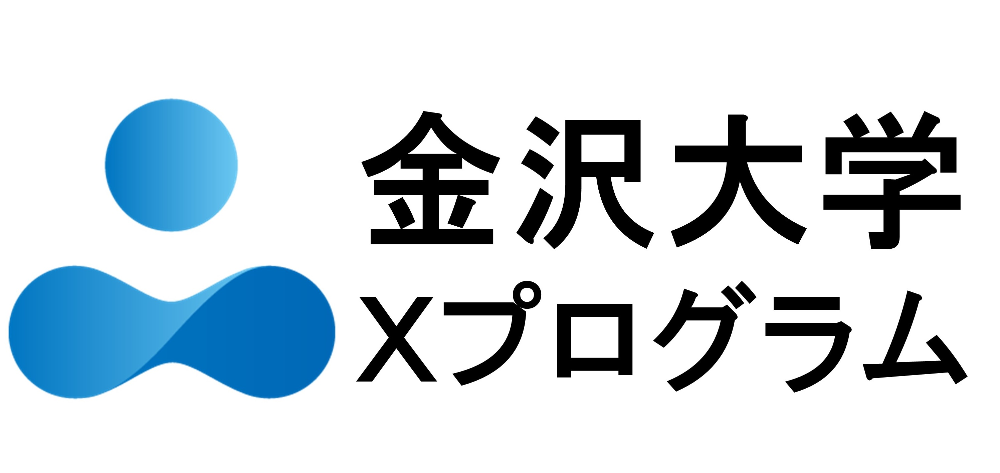

# 第11回プライバシーワークショップ (PWS2025)

## What's new
- 2026/02/10(火) [PWS MeetUp 2026 開催のお知らせ](./MeetUP2026.html)
- 2025/12/28(日) [PWS Cup 企画セッションの参加報告資料を作成](./pws2025_session_report.html)
- 2025/07/14(月) [PWS Cup 2025のページを作成](./cup25.html)

## PWS(Privacy Workshop)について
### 概要
国内外においてビッグデータ活用ニーズが急速に高まる中で、データの効果的な活用とプライバシー保護を両立させる技術や規準の発展と確立が強く求められています。そのためには、プライバシー保護技術の研究開発を進める学術機関とデータ活用の現場で活躍する技術者・専門家との間での議論や交流を活発にし、日本におけるプライバシー保護技術の研究開発を活性化していくことが重要と考えられます。

上記を目的として、情報処理学会コンピュータセキュリティ研究会 (CSEC研究会) はPWS組織委員会を立ち上げ、同学会セキュリティ心理学とトラスト研究会 (SPT研究会)との共催で「プライバシーワークショップ(PWS)」を開催いたします。PWSは、コンピュータセキュリティシンポジウム (CSS)の併催として年に一度開催予定であり、主にデータ活用を円滑にするためのプライバシー保護技術に焦点を当てた企画およびセッションから構成されます。

### 開催日時
- 2025/10/27(月)-2025/10/31(金)

### PWS2025実行委員会
<dl>
  <dt>委員長</dt>
  <dd>千田浩司（群馬大学）</dd>
  <dt>副委員長</dt>
  <dd>須川 賢洋（新潟大学）</dd>
  <dt>委員（五十音順）</dt>
  <dd>
    

      荒井 ひろみ（理化学研究所）  
      伊藤 聡志（愛知学院大学）  
      伊藤 伸介（中央大学）  
      井口 誠（Kii）  
      牛田 芽生恵（富士通）  
      落合 桂一（横浜市立大学）  
      小野 元（金沢大学）  
      菊池 浩明（明治大学）  
      黒政 敦史（データ社会推進協議会）  
      椎名 峻平（トヨタ自動車）  
      清 雄一（電気通信大学）  
      高木 理（群馬大学）  
      高橋 翼（Acompany）  
      竹之内 隆夫（Acompany）  
      寺田 雅之（NTTドコモ）  
      中川 裕志（理化学研究所）  
      中村 優一（ソフトバンク）  
      西山 賢志郎（平田機工）  
      野島 良（立命館大学）  
      東 貴範（TOPPANデジタル）  
      古川 諒（NEC）  
      波多野 卓磨（日鉄ソリューションズ）  
      濱田 浩気（NTT社会情報研究所）  
      藤崎 千尋（TOPPANホールディングス）  
      藤田 真浩（三菱電機）
      馬 瑞強（Inner Mongolia University of Technology）
      前田 若菜（LINEヤフー）  
      三浦 尭之（NTT社会情報研究所）  
      南 和宏（統計数理研究所）  
      美馬 正司（日立コンサルティング）  
      村上 隆夫（統計数理研究所）  
      森 毅（日本総合研究所）  
      山田 明（兵庫県立大学）
    

  </dd>

  <dt>プログラム委員長</dt>
  <dd>高橋 翼（Acompany）</dd>

  <dt>プログラム副委員長</dt>
  <dd>清 雄一（電気通信大学）</dd>

  <dt>プログラム委員</dt>
  <dd>
    荒井 ひろみ（理化学研究所）  
    牛田 芽生恵（富士通）  
    小野 元（金沢大学）  
    椎名 峻平（トヨタ自動車）  
    三浦 尭之（NTT社会情報研究所）  
    村上 隆夫（統計数理研究所）
  </dd>
</dl>

### 参加登録
PWS2025への参加登録は、[コンピュータセキュリティシンポジウム2025 (CSS2025)](https://www.iwsec.org/css/2025/) への参加登録と共通となっております (ご登録頂くと、CSS2025および併催の他のワークショップにも参加が可能です)。

### 論文投稿
PWS2025への論文投稿受付は、[コンピュータセキュリティシンポジウム2025 (CSS2025)](https://www.iwsec.org/css/2025/) への論文投稿受付と共通となっております。特にPWS2024でのご発表を希望される場合、発表申し込みの手続きにおいて「PWS」をお選びください。

### 論文賞
PWS優秀論文賞とPWS学生論文賞はCSS論文賞に統合されました。詳しくは[CSS論文賞について](https://www.iwsec.org/css/2025/award.html#css) をご覧ください。

## 協賛組織

## 後援組織
<!--  -->
[個人情報保護委員会](https://www.ppc.go.jp/)

## 過去のPWS
- [PWS2024](https://www.iwsec.org/pws/2024/)
- [PWS2023](https://www.iwsec.org/pws/2023/)
- [PWS2022](https://www.iwsec.org/pws/2022/)
- [PWS2021](https://www.iwsec.org/pws/2021/)
- [PWS2020](https://www.iwsec.org/pws/2020/)
- [PWS2019](https://www.iwsec.org/pws/2019/)
- [PWS2018](https://www.iwsec.org/pws/2018/)
- [PWS2017](https://www.iwsec.org/pws/2017/)
- [PWS2016](https://www.iwsec.org/pws/2016/)
- [PWS2015](https://www.iwsec.org/pws/2015/)

## プライバシーポリシー
- [こちら](privacy_policy.html)をご参照ください
