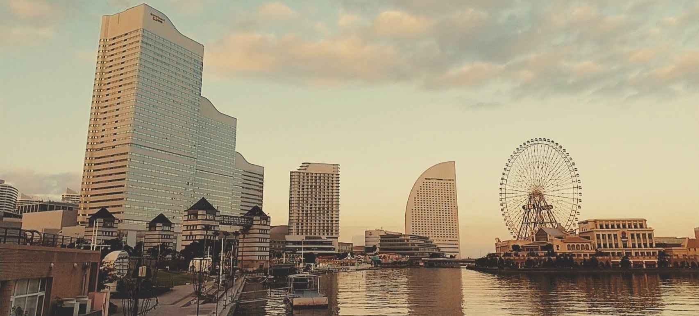
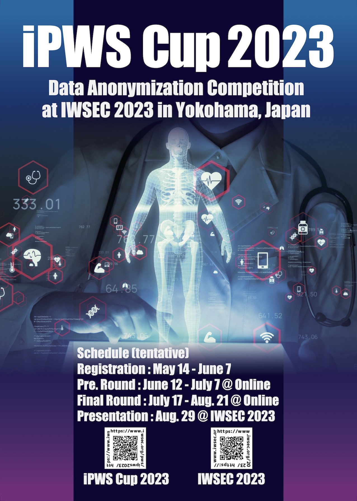

# Data Anonymization Competition
# iPWS Cup 2023

 

## What's new
- July 27th, 2023:
    - Updated the iPWS Cup 2023 schedule (Final presentation).
    - Added [IWSEC 2023 Program page](https://www.iwsec.org/2023/program.html) to the link list.
- June 19th, 2023: Added [FAQ](https://codalab.lisn.upsaclay.fr/competitions/13907#learn_the_details-instruction) to the link list.
- June 12th, 2023: Preliminary round started.
- June  1st, 2023: Uploaded the [Call For Participation (CFP)](./Images/docs/CFP2023.pdf). **The registration deadline has been extended!**
- May  27th, 2023: Corrected dates of the Final Round.
- May  14th, 2023: Registration period has started!
- Mar.  9th, 2023: Opened this page.

## Useful links for competitions
- [IWSEC 2023 Program page](https://www.iwsec.org/2023/program.html)
- [CodaLab competition platform](https://codalab.lisn.upsaclay.fr/competitions/13907)
- [iPWS Cup instruction manual](https://docs.google.com/document/d/1eF8P3X60fmc0yuC14ixtLq81ORSkIe5HCy3T9I25Ha8/edit)
- [GitHub repository for reference source codes and the definitions of metrics](https://github.com/kikn88/ipwscup2023)
- [FAQ](https://codalab.lisn.upsaclay.fr/competitions/13907#learn_the_details-instruction)

## Rules (overview)
### Story
In the story of iPWS Cup 2023, we intend to provide health data that contain diagnostic outcomes to researchers who study to predict risks of acquiring diabetes. The data contain records that include extreme high body-mass index (BMI). In the anonymization phase, each participating team of the iPWS Cup 2023 anonymizes health data in order to prevent identifying medical examinees. In the attack phase, each team checks whether anonymized data generated by other teams include their team's records or not. Once the inclusion is detected, identify the record from the anonymized data. The winner of the iPWS Cup 2023 will be a team that generated the most secure and useful health data.

## iPWS Cup 2023 schedule

| Date | Event |
| :--- | :---- |
| May  14th - June  **7th**, 2023. | Team registration(**Extended**) |
| June **12th** - June **21st**, 2023. | Preliminary round 1 Anonymization (**10 days**) |
| June **28th** - July  **7th**, 2023. | Preliminary round 2 Attack (**10 days**) |
| July 17th - July 31st, 2023. | Final round 1 Anonymization (2 weeks) |
| Aug.  7th - Aug. 21st, 2023. | Final round 2 Attack (2 weeks) |
| Aug. ~~29th~~ **28th 15:00-18:00(JST)**, 2023. | Final presentation in Yokohama (**Day 0**). Please refer to the [IWSEC 2023 Program page](https://www.iwsec.org/2023/program.html) for the details. |

## Prizes
- 1st prize: 50,000 JPY on VISA Gift Card and no charge for participation (up to 1 person)
- 2nd prize: 30,000 JPY on VISA Gift Card and no charge for participation (up to 1 person)
- 3rd prize: 10,000 JPY on VISA Gift Card and no charge for participation (up to 1 person)
- Best Attack Award: 10,000 JPY on VISA Gift Card

## How to participate in the iPWS Cup 2023
### Team requirement
- A team consists of several members. There is no limitation on the number of members per team. A team with only one member is acceptable.
- Members may be from different affiliations.
- A person cannot belong to more than one team. This rule is set to avoid any collusion among teams.
- The affiliation and member names will be hidden during the competition; only team names will be displayed.
- **At least one person per team needs full registration** to IWSEC 2023 (main conference).
    - The contact person does not always make the registration but one person in the team needs to join the main conference. Other members may join the competition for free of charge.
- We plan to discount the admission fee for participants only for the competition.
- Please contact secretary-ipwscup2023(at)iwsec.org (replace (at) with @) for more information.

### How to apply for the competition
1. Sign up on [CodaLab](https://codalab.lisn.upsaclay.fr/) since we are planning to run our competition on this open-source platform. **Each team needs to create one account**.\[[Quick guidance on how to sign-up](https://docs.google.com/document/d/15gq90xjbmNKMTcgf9qZA6ri0bS6QKWaNw8BkIeG3EUw/edit#)\]
1. Fill in the \[[team registration form](https://docs.google.com/forms/d/e/1FAIpQLSe-Qyit8td6EmbRXJv_mmcsA_BGuL1XDBXHUzP0zSxHML4v2g/viewform)\].
1. Wait for the competition to be ready. Once ready, we will announce it to you with further instructions on how to participate in the competition.

## How to play the anonymization phase (preliminary round)
1. Your set of 10 healthcare data will be sent to the email address specified at the registration.
1. Log-in the competition platform, CodaLab, with using your team’s CodaLab account that you have already signed in and submitted from the registration. This site will serve as your primary platform for accessing competition guidelines and submitting your work.
1. Follow the steps [the instruction manual](https://docs.google.com/document/d/1eF8P3X60fmc0yuC14ixtLq81ORSkIe5HCy3T9I25Ha8/edit) (Applying to the competition, Setting your team names, and Anonymization phase instructions). It assists you in navigating the competition.

## Participating teams
<table border="1">
<tr><td> Team ID </td><td> Team name </td><td> Message to competitors </td></tr>
<tr><td> 01 </td><td> KUdisc </td><td> Yesterday's friend is today's enemy. </td></tr>
<tr><td> 02 </td><td> nssol-alchemist </td><td> Let's gooooo </td></tr>
<tr><td> 03 </td><td> NYCU Questers </td><td> 一緒に頑張りましょう！ (Translated: Best of luck for all of us!) </td></tr>
<tr><td> 04 </td><td> Gunmataro116luxury </td><td>-</td></tr>
<tr><td> 05 </td><td> Take No Consensus </td><td> Victory!!! </td></tr>
<tr><td> 06 </td><td> DOG </td><td> I'll do my best </td></tr>
<tr><td> 07 </td><td> LIFAnonymous </td><td>-</td></tr>
<tr><td> 08 </td><td> THREE </td><td>-</td></tr>
<tr><td> 09 </td><td> imutG </td><td> Open our arms & embrace the world </td></tr>
<tr><td> 10 </td><td> Seven Team </td><td>-</td></tr>
</table>

## Committee
<dl>
 <dt>Chair</dt>
 <dd>Hiroaki Kikuchi, Meiji University, Japan</dd>
<dt>Members</dt>
 <dd>Makoto Iguchi, Kii Corporation, Japan</dd>
 <dd>Atsushi Kuromasa, Data Society Aliance, Japan</dd>
 <dd>Koji Chida, Gunma University, Japan</dd>
 <dd>Yuichi Nakamura, SoftBank Corp., Japan</dd>
 <dd>Takuma Hatano, NS Solutions Corporation, Japan</dd>
 <dd>Koki Hamada, NTT Social Informatics Laboratories, Japan</dd>
 <dd>Wakana Maeda, LINE, Japan</dd>
 <dd>Akira Yamada, Kobe University, Japan</dd>
 <dd>Takayuki Miura, NTT Social Informatics Laboratories, Japan</dd>
 <dd>MA Ruiqiang, Meiji University, Japan</dd>
 <dd>Chia-Mu Yu, National Yang Ming Chiao Tung University, Taiwan</dd>
 <dd>Hiromi Arai, RIKEN, Japan</dd>
 <dd>Hiroto Eguchi, TOPPAN, Japan</dd>
 <dd>Josep Domingo-Ferrer, Universitat Rovira i Virgili, Catalonia</dd>
 <dd>Alberto Blanco-Justicia, Universitat Rovira i Virgili, Catalonia</dd>
 <dd>Najeeb Jebreel, Universitat Rovira i Virgili, Catalonia</dd>
 <dd>Isaac Agudo, University of Malaga, Spain</dd>
 <dd>Ruben Rios, University of Malaga, Spain</dd>
</dl>

## Contact
iPWS Cup Committee  
secretary-ipwscup2023(at)iwsec.org (replace (at) with @)
