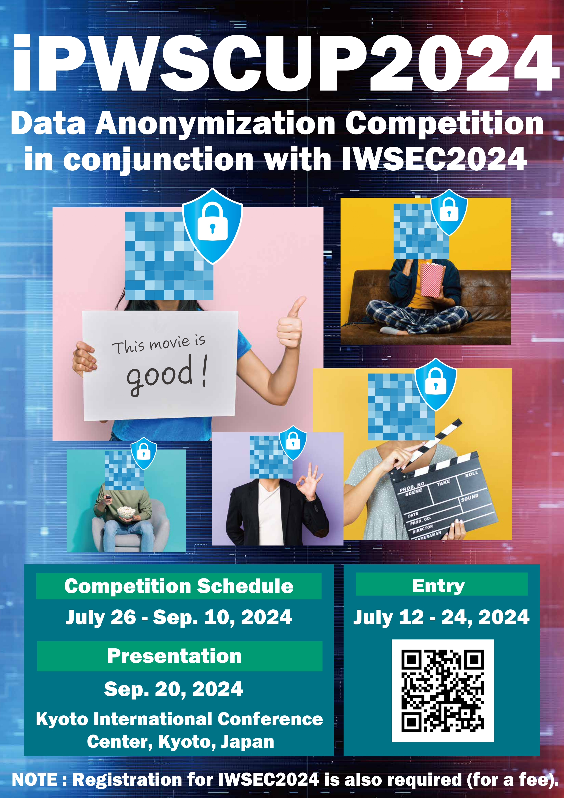

# Data Anonymization Competition
# iPWS Cup 2024
# (held in conjunction with [IWSEC 2024](https://www.iwsec.org/2024/))

 

 

## What's new
- September 15th, 2024: Published winners and final program.
- August 29th, 2024: Added the information for the final presentation on 20 September, 2024.
- August 20th, 2024: Published [data for the attack phase](./Images/ipwscup2024AttackData.zip).
- August 20th, 2024: Published [the result of anonymization phase](./Images/AnonymizationPhaseScore.csv).
- July 31st, 2024: Rulebook updated to [Ver 1.2](./Images/20240731_iPWSCUP2024.pdf) (Some minor changes to the scoring rules on page 14.).
- July 26th, 2024: Added participating teams.
- July 25th, 2024: Rulebook updated to [Ver 1.1](./Images/20240725_iPWSCUP2024.pdf).
- July 16th, 2024: Added [Sample scripts](https://github.com/pwscup/pwscup2024-scripts).
- July 14th, 2024: Added [Rules explanation slides](./Images/20240714_iPWSCUP2024.pdf).
- July 11st, 2024: Added [entry](./entry.html) page.
- July 12nd, 2024: Added poster.
- June 20th, 2024: Opened this page.

## Useful links for competitions
- [IWSEC 2024](https://www.iwsec.org/2024/)

## About iPWS Cup 2024
### Story
Company A wants to develop a movie recommendation system using customer data. The company decides to anonymize customer data for a competition to develop a recommendation system and make it available to the participants of the competition. However, even with the intention of anonymizing the data, there have been cases of personal identification and privacy breaches due to matching with external data. More recently, there has also been the problem of "database reconstruction attacks", where even anonymized data can be combined with supposedly secure statistical data to reconstruct the original data. Can Company A create highly useful anonymized data while preventing personal identification attacks and database reconstruction attacks?

### Competition Overview
Each participating team takes on the roles of both anonymizer and attacker, competing in data anonymizing techniques and attacks on the anonymized data. In the data anonymization phase, each team takes the role of a company that wants to publish customer data and aims to protect the privacy of the people in the data by anonymizing the given data. In the attack phase, each team becomes an attacker who wants to discover the contents of the data and aims to discover more secret information about the individual contained in the data anonymized by other teams.

### Procedure
The competition consists of two phases.

<strong>Anonymization Phase:</strong> Each team will produce a set of anonymized data from fictitious data on movie ratings (each anonymized data will be processed from original multi-attribute data, from which only the attributes necessary for analysis will be extracted). The anonymized data must be processed in a way that makes it difficult for others to identify the original information, with as little loss of utility as possible.

<strong>Attack Phase:</strong> Each team restores the values of the original data, some of which have been redacted by the other team, using anonymized data (database reconstruction attack). They also try to identify individuals by linking the original data, from which names etc. have been removed, to their names etc. using anonymized data.

After these have been performed in turn, the results of each team's anonymization and attacks will be evaluated by the organizer. The anonymization is evaluated in terms of the closeness of the analysis results obtained from the anonymized and original data (the closer, the better) and the difficulty of correctly guessing the secret data of the other team (the more difficult, the better), while the attack is evaluated in terms of the accuracy of the guesses made by the other team on the anonymized data (the more accurate, the better).

## iPWS Cup 2024 schedule
<table border="0">
<tr><td> <strong>Date</strong> </td><td> <strong>Event</strong> </td></tr>
<tr><td> July 12th (Fri) - 24th (Wed), 2024</td> <td> Team registration </td></tr>
<tr><td> July 26th (Fri) - ~~August 16th (Fri)~~ August 19th (Mon), 2024</td> <td> Anonymization phase</td></tr>
<tr><td> August 20th (Tue) - September 10th (Tue), 2024</td> <td> Attack phase</td></tr>
<tr><td> September 20th (Fri), 2024</td> <td> Final presentation in Kyoto, Japan (on-site event)</td></tr>
</td></tr>
</table>

### Final presentation
- Date: September **20th**, 10:00-14:00(JST)
- Venue: [Kyoto International Conference Center, Room 510](https://www.iwsec.org/2024/venue.html)
- Registration desk: [Room 510](https://www.icckyoto.or.jp/en/facility-overview-2/hall_and_room/room_501_509_510/), the 5th floor of the venue

#### Final Presentation Program
1.  9:30- Reception
2.  10:00-10:10 Opening Ceremony
3.  10:10-11:00 Presentation of Team 01-05 (10 minutes each)
4.  11:00-11:20 Break
5.  11:20-12:10 Presentation of Team 06-10 (10 minutes each)
6.  12:10-12:30 Awards and Closing Ceremony
    1.  Group photo
7.  12:30-14:00 Lunch & Open discussion

**NOTICE**  
There will be a reception for iPWS Cup participants on 19 September at 18:00(JST).  
If you would like to attend, please contact ipwscup2024-inquiry(at)csec.ipsj.or.jp (replace (at) with @) by 11 September.
We will respond with more information.

## Prizes
- 1st prize: 50,000 JPY on VISA Gift Card
- 2nd prize: 30,000 JPY on VISA Gift Card
- 3rd prize: 10,000 JPY on VISA Gift Card
- Best Attack Award: 10,000 JPY on VISA Gift Card

## Documents/Resources
- [Rulebook Ver 1.2](./Images/20240731_iPWSCUP2024.pdf)
- [Rulebook Ver 1.1](./Images/20240725_iPWSCUP2024.pdf)
- [Rulebook Ver 1.0](./Images/20240714_iPWSCUP2024.pdf)
- [Sample scripts](https://github.com/pwscup/pwscup2024-scripts).

## How to participate in the iPWS Cup 2024
### Team requirement
- A team consists of several members. There is no limitation on the number of members per team. A team with only one member is acceptable.
- Members may be from different affiliations.
- A person cannot belong to more than one team. This rule is set to avoid any collusion among teams.
- The affiliation and member names will be hidden during the competition; only team names will be displayed.
- <strong>At least one person per team needs full registration</strong> to [IWSEC 2024](https://www.iwsec.org/2024/) (main conference).
- The contact person does not always make the registration but one person in the team must attend the main conference. Other members ot the team can attend the competition for free of charge. Note that the other members attending the on-site event on 20 September will have to pay the participation fee for the iPWS Cup 2024. Registrations should be made via the [IWSEC 2024 registration site](https://www.iwsec.org/2024/registration.html).

### How to apply for the competition
- Please check the [entry](./entry.html) page.

## How to play the anonymization phase
- See the [codabench page](https://www.codabench.org/competitions/3260/#/pages-tab).

## How to play the attack phase
- See the [codabench page](https://www.codabench.org/competitions/3260/#/pages-tab).

## Participating teams

<table border="1">
<tr><th>Team ID</th><th>Team Name</th><th>Message</th><th>Representative</th><th>Affiliation</th></tr>
<tr><td>01</td><td>Strive-Legends</td><td>-</td><td>-</td><td>-</td></tr>
<tr><td>02</td><td>KU$\nu\tau\tau$</td><td>Both the horse and Botchi escaped.</td><td>Masaya Kobayashi</td><td>Kanagawa University</td></tr>
<tr><td>03</td><td>Takenoko Movie Guardians</td><td>Victory!!</td><td>-</td><td>-</td></tr>
<tr><td>04</td><td>Kamo</td><td>-</td><td>-</td><td>-</td></tr>
<tr><td>05</td><td>brian</td><td>Yay!</td><td>-</td><td>Virginia Tech</td></tr>
<tr><td>06</td><td>Thieves Sttk</td><td>No more movie thief</td><td>Taisei Tashiro</td><td>-</td></tr>
<tr><td>07</td><td>Diamond</td><td>-</td><td>-</td><td>-</td></tr>
<tr><td>08</td><td>TokumeiAnonymous</td><td>^^</td><td>-</td><td>-</td></tr>
<tr><td>09</td><td>AnoNICSmous</td><td>Let's preserve privacy!</td><td>Pablo Sanchez-Serrano</td><td>NICS Lab, University of Malaga</td></tr>
<tr><td>10</td><td>re:Botchi</td><td>All your reviews are belong to us</td><td>Makoto Iguchi</td><td>Kii Corporation</td></tr>
</table>

<table border="1">
<tr><th>Team ID</th><th>Account</th><th>Disribution Data</th><th>Selected Data</th></tr>
<tr><td>01</td><td>rq1543179</td><td>~~00, 04, 05~~ 12, 16, 17</td><td>16</td></tr>
<tr><td>02</td><td>mkoba</td><td>~~35, 42, 47~~ 38, 44, 49</td><td>38</td></tr>
<tr><td>03</td><td>takenoko</td><td>~~51, 52, 53~~ 54, 56, 57</td><td>57</td></tr>
<tr><td>04</td><td>user1234</td><td>~~06, 07, 08~~ 18, 19, 20</td><td>18</td></tr>
<tr><td>05</td><td>brian</td><td>~~25, 60, 89~~ 26, 62, 90</td><td>90</td></tr>
<tr><td>06</td><td>tashiro</td><td>~~37, 43, 59~~ 39, 45, 61</td><td>61</td></tr>
<tr><td>07</td><td>diamond2024</td><td>~~01, 02, 03~~ 13, 14, 15</td><td>15</td></tr>
<tr><td>08</td><td>tokumei</td><td>~~32, 48, 87~~ 34, 50, 88</td><td>88</td></tr>
<tr><td>09</td><td>pablosanserr</td><td>~~09, 10, 11~~ 21, 22, 23</td><td>23</td></tr>
<tr><td>10</td><td>igucci</td><td>~~33, 55, 77~~ 36, 58, 78</td><td>36</td></tr>
</table>

## Final result
- [Excel ver.](./Images/result.xlsx)
- [PDF ver.](./Images/result.pdf)

### Overall
- 1st Prize : Kamo (Team 04)
- 2nd Prize : brian (Team 05)
- 3th Prize : re:Botchi (Team 10)

### Best Attack
- Kamo (Team 04)

### Best Presentation
- re:Botchi (Team 10)

### Best Data Scientist
- Takenoko Movie Guardians (Team 03)

## Committee
<dl>
 <dt>Chair</dt>
 <dd>Koji Chida, Gunma University, Japan</dd>
 <dt>Members</dt>
 <dd>Masahiro Fujita, Mitsubishi Electric, Japan</dd>
 <dd>Makoto Iguchi, Kii, Japan</dd>
 <dd>Hiroaki Kikuchi, Meiji University, Japan</dd>
 <dd>Ruiqiang Ma, Inner Mongolia University of Technology, China</dd>
 <dd>Takayuki Miura, NTT, Japan</dd>
 <dd>Yuichi Nakamura, SoftBank Corp., Japan</dd>
 <dd>Takuma Hatano, NS Solutions Corporation, Japan</dd>
</dl> 

## Contact
ipwscup2024-inquiry(at)csec.ipsj.or.jp (replace (at) with @)
